# Проект [VK Реклама](https://ads.vk.com/)

## Содержание:

1. [Опросы](#Опросы)
2. [Создание кампании](#Создание-кампании)
3. [Аудитории](#Аудитории)
4. [Создание каталога](#Создание-каталога)

## Опросы

### Как попасть на страницу

Либо перейти по ссылке [https://ads.vk.com/hq/leadads/surveys](https://ads.vk.com/hq/leadads/surveys)

Либо на боковой панели выбрать пункт ```Лид-формы и опросы```

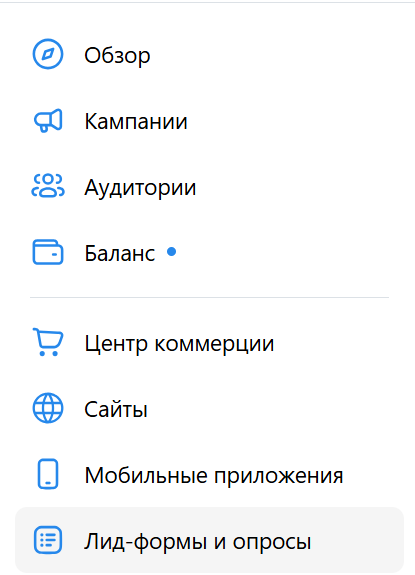

Затем выбираем отображаемый фрагмент - ```Опросы```

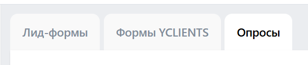

На странице на которую попали одним из 2-ух образов нажимаем на кнопку ```Создать опрос```

### Проверим функциональности

Заполним 1-ый раздел данных тестовыми значениями:

- Название: ```FlexiKanban```
- Логотип:

- Название компании: ```FlexiKanban```
- Заголовок опроса: ```Разделим😎?```
- Описание опроса: ```Не хватало ли Вам возможности автоматически делить и соединять задачи на своих досках?```
- Стили: выбираем фиолетовый:
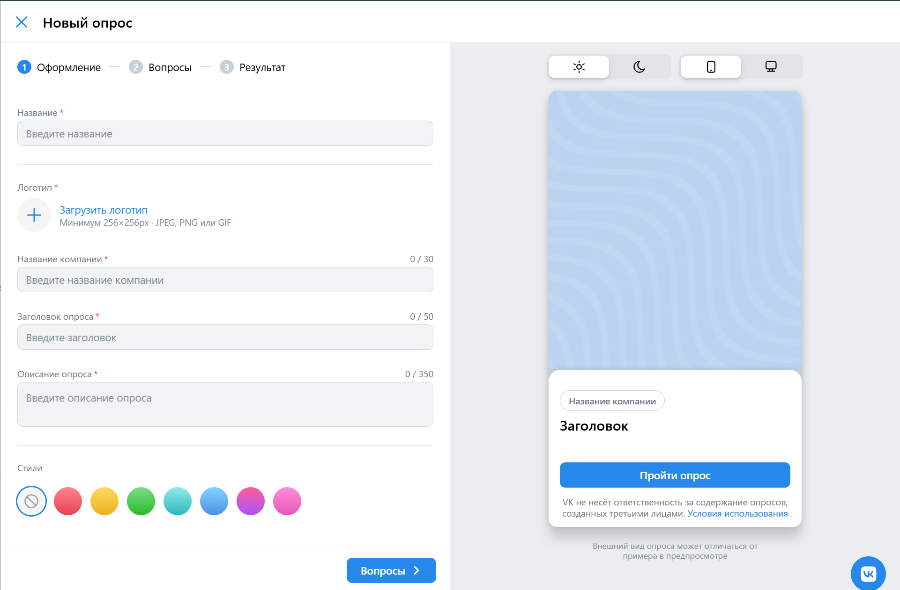

Получили:


Нажмем на кнопку ```Вопросы``` и заполним поля новой формы

- Текст вопроса: ```Хотели бы Вы иметь возможность, делить задачи на доске одной кнопкой, а потом теми де услиями соединять их?```
- Введите ответ: ```Да```
- Введите ответ: ```Нет```

Нажмем добавить вариант и введем: ```Нейтрально``` 

Нажмем на ```Ответ из шаблона``` и выберем ```Другое (свой ответ)```

С помощью иконки 


удалим вариант ответа ```Нейтрально``` и добавим по ранее описанному методу точно такой же вариант ответа.

Получаем:

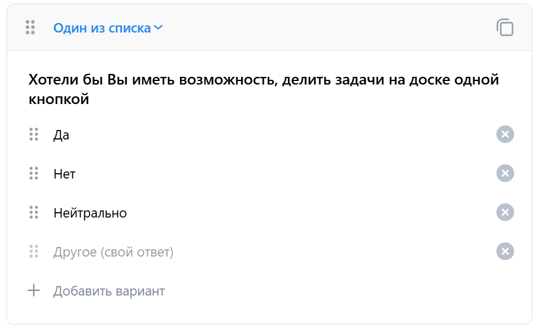

Нажмем ```Добавить вопрос```

У нового вопроса изменим ```Один из списка``` на ```Шкала```, для этого нажмем на ```Один из списка``` и выберем соответствующий пункт.

Изменим диапазон с ```0-10``` на ```1-10``` аналогичным смене типа вопроса способом.

Зададим текст вопроса: ```Оцените, насколько бы вы хотели увидеть этот функционал у нас```

```Скорее нет``` изменим на ```Нет```, а ```Скорее да``` - на ```Да```

Через иконку 

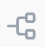

Добавим условие показа

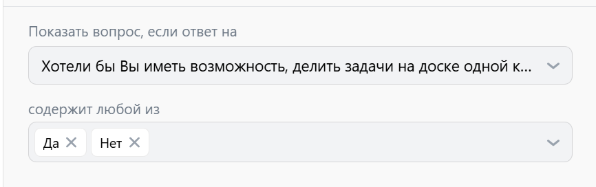

В ```Показать вопрос, если ответ на``` выбрав один из вопросов, а в ```содержит любой из``` несколько вариантов ответа

Создадим ещё 1 вопрос, изменив его тип на ```Ответ в свободной форме```
- Текст вопроса: ```Напишите свои пожелания для этого функционала```

Создадим для него условие показа и повторным нажатием на иконку удалим его.

И наконец добавим последний вопрос:

- Тип: ```Несколько из списка```
- Текст вопроса: ```Что бы Вы хотели увидеть?```
- Введите ответ: ```Функционал соединения задач```
- Введите ответ: ```Функционал разделения задач```

Получим:

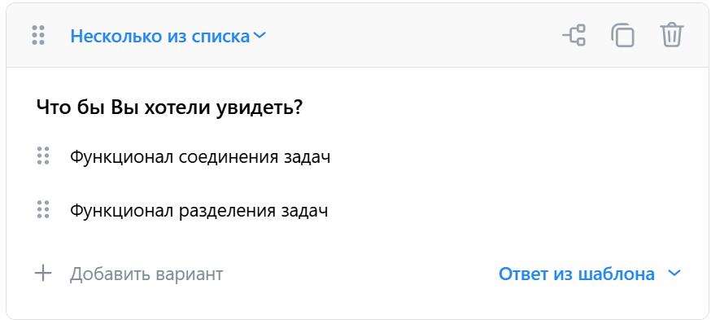

Продублируем этот вопрос нажав на иконку


В дубликате поменяем местами варианты ответ с помощью иконок 


И с помощью подобной иконки перенесем дубликат над вопросом со шкалой

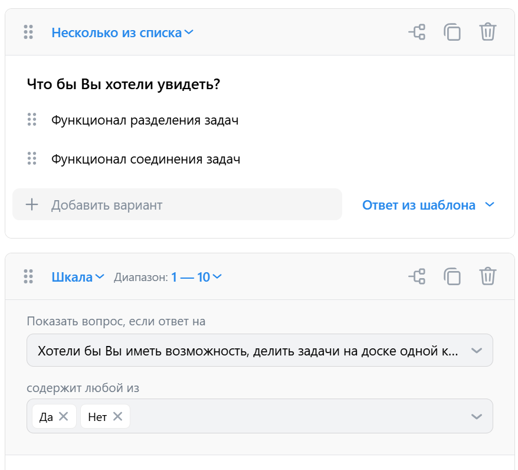

Удалим вопрос из которого получили дубликат

Вопрос:

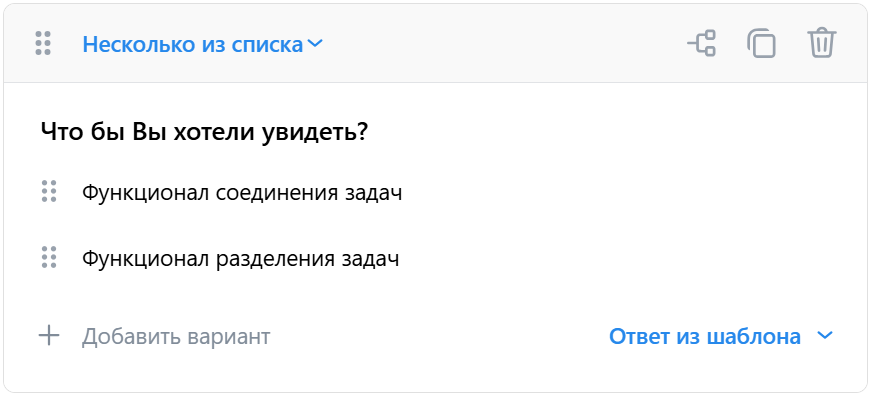

Для этого нажмем на иконку

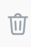

у соответствующего вопроса.

И наконец добавим стоп-экран через нажатие на кнопку: ```Добавить стоп-экран```

Проверим функционал его удаления через иконку


и вернем его обратно через нажатие на описанную выше кнопку ```Добавить стоп-экран```.

Введем:
- Завершить опрос, если ответ на: ```Хотели бы Вы иметь возможность, делить задачи на доске одной кнопкой```
- содержит любой из: ```Нет```, ```Нейтрально```
- Заголовок экрана: ```Спасибо, Вам за участие!```
- Описание: ```Вы нам очень помогли, оставив своё мнение по поводу этого вопроса!```

Результат:

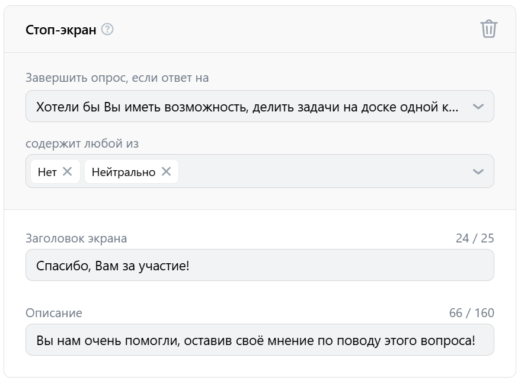

Нажмем на кнопку ```Результат```

На этой форме поменяем поля на
- Заголовок: ```Спасибо за Ваши ответы!```
- Описание: ```Заявка отправлена, попытаемся учесть все Ваши пожелания, ждите результат на нашем сайте!```

Нажмем на кнопку ```Добавить ссылку```

и в появившееся поле ```Ссылка``` введем ```https://github.com/AnyFlex-Solutions```

Получим:

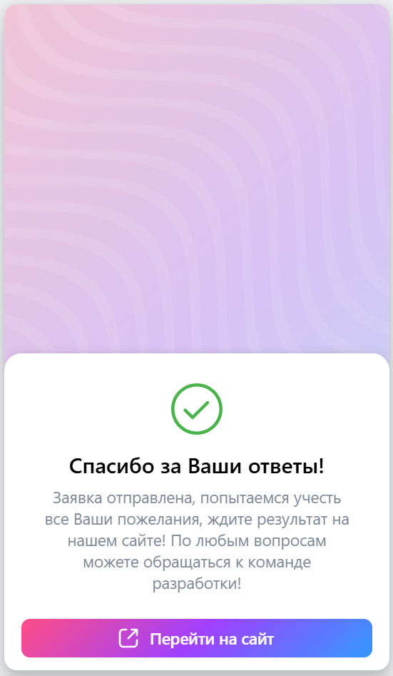

И нажмем на кнопку ```Запустить опрос```

Результат:

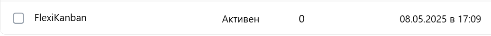

Получившийся опрос можно редактировать (те же поля, что и при создании), либо удалить, нажав на ```Архивировать```

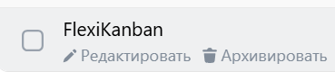

В появившемся окне

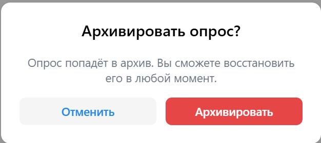

Нажимаем на кнопку ```Архивировать```

Получаем

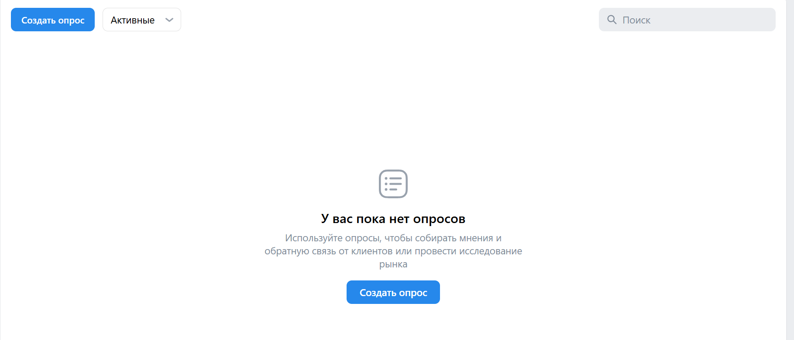

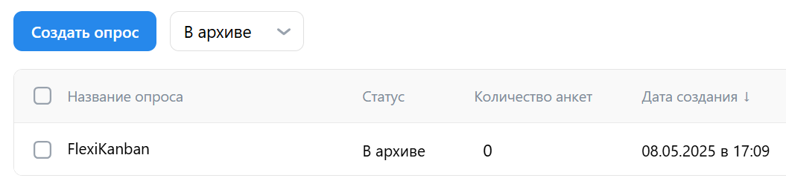

Попробуем отредактировать наш Опрос, для этого восстановим его

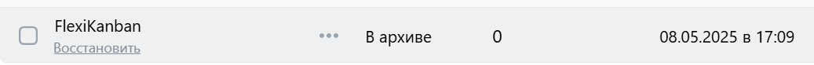

Нажмем ```воcстановить``` и в появившейся форме нажмем кнопку ```Восстановить```


Теперь отредактируем опрос, нажав на ```редактировать```

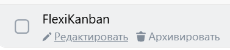

Теперь посмотрим как отработает система если не ввести несколько обязательных полей, например не введем ```Название компании``` и ```Описание опроса```

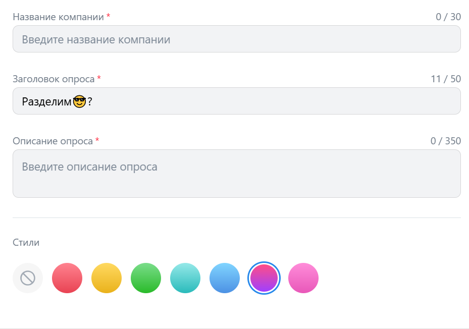

и нажмем на кнопку ```Вопросы```. Система подсветила красным не введенные поля

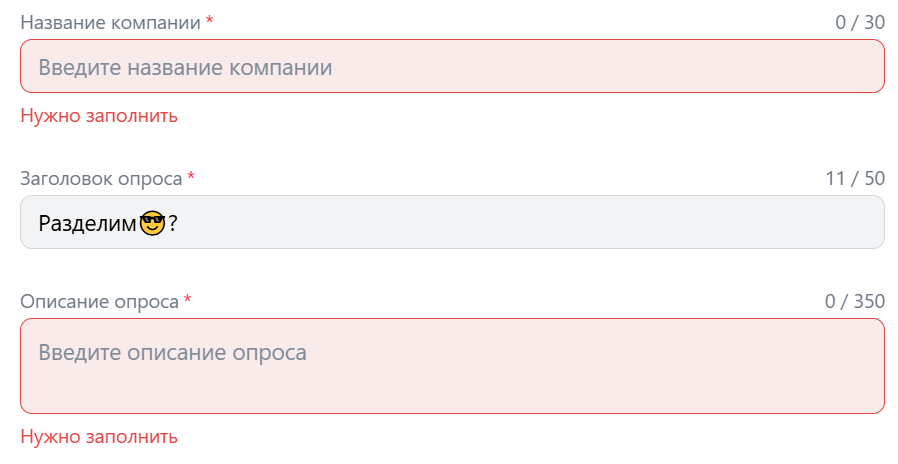

Попробуем сохранить это результат через закрытие окна редактирования, для этого нажмем на любое место вне окна редактирования

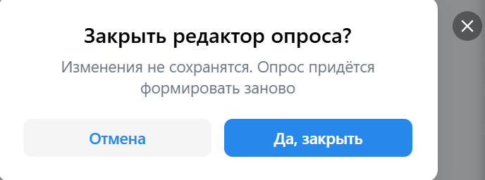

В отличие от сценария когда изменено на корректные данные, система не предлагает возможности сохранения изменений.

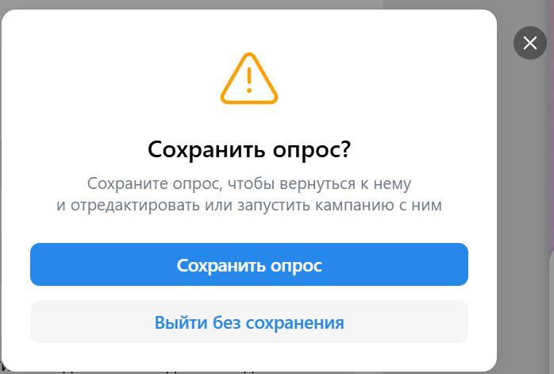

Проверим на превышение количество символов, введем в поле ```Название компании``` значение ```FlexiKanbanFlexiKanbanFlexiKanban```

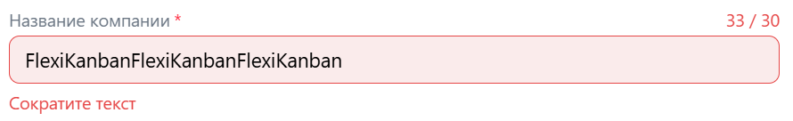

Поле, загорелось красным, такой результат сохранить нельзя.

Теперь проверим, что можно делать с уже готовым опросом.

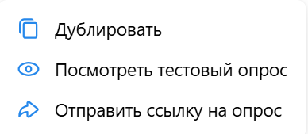

Проверим работу функционала дублирования.

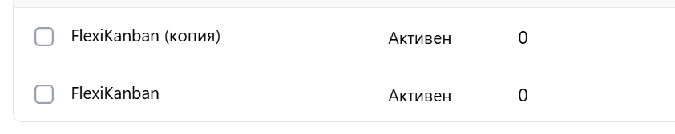

Создается копия, с единственным изменением: в новом опросе в название добавляется часть ```(копия)```

Теперь посмотрим тестовый опрос, он позволяет пройти опросом, при этом результат сохраняется в системе

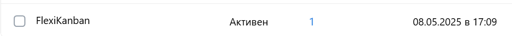

При нажатии на ```Отправить ссылку на опрос``` в буфер обмена копируется ссылка на опрос по типу ```https://ads.vk.com/public/leadform?d=CZ6WKnr3VywTYzLQ1x5SxsS%2B8irbvAd%2Fs1ovoLhOpjQ%3D&type=survey```

Так же можно функционировать сразу с несколькими опросами.

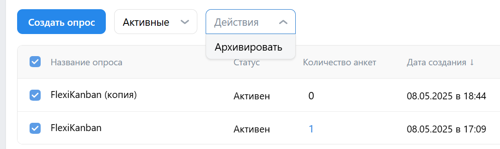

Можно архивировать сразу несколько опросов, аналогично можно восстанавливать, но после этого обратно архивируем.

## Создание кампании

### Как попасть на страницу

Либо перейти по ссылке [https://ads.vk.com/hq/dashboard/ad_plans?mode=ads&attribution=conversion&date_from=07.05.2025&date_to=08.05.2025&sort=-created](https://ads.vk.com/hq/dashboard/ad_plans?mode=ads&attribution=conversion&date_from=07.05.2025&date_to=08.05.2025&sort=-created)

Либо на боковой панели выбрать пункт ```Кампании```


На странице на которую попали одним из 2-ух способов нажимаем на кнопку ```Создать кампанию```

### Проверим функциональности

Параметром рекламы зададим целевое действие


Выберем то, что будем рекламировать, выберем - ```сайт```

Заполним поле:

- Рекламируемый сайт: ```https://github.com/AnyFlex-Solutions```
- Важные детали и отличия от конкурентов: ```Основной уклон к автоматизации действий пользователей при использовании канбан досок```
- Целевое действие: ```Клики по рекламе```
- Учитывать офлайн-конверсии: ```False```
- Стратегия ставок: ```Минимальная цена```
- Бюджет: ```100``` ```за всё время```
- Даты проведения: ```08.05.2025``` ```08.05.2025```

Если набрать цену меньше 0, то поле подсветится красным, аналогично при незаполнении поле или выходе за количество допустимых символов

Если не заполнить поле, то ещё появляется уведомление


Проверим другие возможности выбора:

#### Каталог товаров

Если объект рекламы сайт:
- Рекламируемый сайт: ```https://github.com/AnyFlex-Solutions```

Каталог товаров: 


Нажимаем ```Создать каталог```

- Название: ```Каталог 2025-05-09```
- Добавление позиций: ```Фид или сообщество```: 
- Ссылка на фид или сообщество: ```https://vk.com/youla_ru```
- Период обновления: ```Ежедневно```
- Автоматически удалять UTM-метки: ```False```


Если объект рекламы мобильное приложение:

Рекламируемое приложение: при клике появляется окно


Нажимаем ```Привязать новое приложение``` и вводим ссылку на произвольное приложение после чего нажимаем на кнопку ```Добавить```

Пытаемся ввести некорректную ссылку: ```https://github.com/AnyFlex-Solutions```, получаем:


Каталог товара аналогичен тому, что описан в сайте

Если объект рекламы - Сообщество ВКонтакте:

Добавим сообщество, при выборе ```FlexiKanban``` вывело


Так как в ней нет товаров и услуг, а вот при выборе ```vk.com/youla_ru``` можем настроить:

- Каталог товаров: ```Товары – Юла```
- Тип кампании: ```Привлечение потенциальных клиентов```

Каталог товара аналогичен тому, что описан в сайте

Остальные настройки те же, что и у рекламы сайта: Целевое действие, Оптимизация бюджета кампании, Стратегия ставок, Бюджет, Даты проведения

Другие ```Целевые действия```, и ```Успеваемость и охват```, и ```Смарт-компания``` аналогичны в полях, с минимальными отличиями

Нажмем кнопку ```Продолжить```, после заполнение одного из типов, например сайта

Заполним форму:

- Стратегия ставок: ```Минимальная цена``` (Это поле нельзя менять)

Нажмем на кнопку ```Настроить дату проведения``` и зададим дату с ```09.05.2025``` по ```09.05.2025```, нажмем Очистить и повторим действие

Нажмем на кнопку ```Настроить время показа```, снизу нажмем кнопку ```Очистить расписание показов``` и нажмем на верхний левый квадратик (пн 00), Учитывать местное время = true, Учитывать праздники = true, и нажимаем на кнопку ```Сохранить```, после этого нажмем на кнопку ```Изменить``` и выберем время показа - ```Будни```, после чего нажмем на кнопку ```Сохранить```

- Регионы показа: выбираем из списка ```Москва```, затем нажимаем на кнопку ```Добавить списком```, вводим в поле ввода ```Россия, Санкт-Петербург``` и нажимаем на кнопку ```Добавить```, нажимаем на ```Очистить все``` и выбираем из списка - ```Москва```
- Расширение аудитории: False
- Демография:
  - Пол: ```Женский```
  - Возраст: ```18``` ```75```
  - Возрастная маркировка: ```12+```
  - Социальная реклама: ```False```
- Интересы и поведение:
  - Интересы (можно удалить):
    - Введите название: ```Крупная кухонная техника```, ```Дачная жизнь``` нажимаем кнопку ```Сохранить```
    - Добавить исключение -> ```Авто эконом класс``` -> ```Сохранить```
  - Ключевые фразы (можно удалить):
    - Ключевые фразы: 
    ```
    1
    2
    3
    4
    5
    ```
    - Минус-фразы:
    ```
    6
    7
    8
    ```
    При дубликатах 

  

    - Период поиска: ```13```
  - Сообщества: ```https://vk.com/club230418380```
- Аудитории (можно удалить): ```Аудитория 2025-05-09```
  - Эту же Аудиторию исключаем, тем самым получая исключение (срабатывает после нажатие на кнопку ```Продолжить``` - выделяет красным и говорит о невозможности такой задачи аудитории, нажимаем - ```Удалить исключения```)
- Устройства:
  - Десктопные: ```true```
  - Мобильные: ```true```
- Параметры URL: ```Не добавлять UTM-метки```
- Места размещения: ```true```

У группы можно изменить название и добавлять ещё группы.

Нажмем на кнопку ```Продолжить```

На последнем этапе создания:

Сначала проверим, что поле Заголовок подстветится, если попробуем закончить создания без его введение (подсветится красным)

Попробуем сгенерировать заголовок с помощью нейросити, для этого нажмем на иконку


Введем промт: ```FlexiKanban открылось для пользователей, готовы помогать Вам на всех этапах жизнедеятельности всех Ваших проектов```, нажимай на первый из предложенных, аналогичным способом сгенерируем короткой и длинное описание; в конце длинного описания добавим смайлик ```😎💯```

Добавим текст перед кнопкой, если ввести ```Мы всегда рады Вам! Присоединяйся скорее к нам!```, то система уведомит, что мы вышли за допустимое количество символов, а если ввести ```Мы всегда рады Вам!```, то система примет это.

Поле ```Ссылка на сайт``` взято из предыдущих заполненных полей (не трогаем его)

Надпись на кнопке: ```Вступить``` (меняем на это значение)

Поменяем логотип на 


Для этого нажмем на кнопку


И выберем необходимый логотип (уже сохранен на предыдущих действиях)

Вставим картинку, через загрузку изображений


Результат:


Нажмем на кнопку ```Добавить ещё формат```, выберем добавляемое - ```Галерея медиафайлов```


Нажмем на надпись ```Коллаж``` и заменим её на ```Слайдер```.

Нажав на символ ```+``` добавим изображений


Через иконку


Поменяй местами изображения

Нажмем на кнопку ```Добавить карусель слайдов```


Нажмем на поле ```Загаловок слайда``` и заполним появившиеся поля:
- Изображение: 1-ое из предложенных (ранее добавляли изображение)
- Заголовок первого слайда: ```Кликай скорее, все новости о нас тут!```
- Описание первого слайда: ```Что-то интересное```
- Ссылка на первую страницу: ```https://vk.com/club230418380``` (выведет ошибку, так как использован запрещенный редирект), введем ```https://github.com/AnyFlex-Solutions```

Создадим 2 точно таких же слайда через нажатие кнопки ```Добавить слайд карусели```

Кликнем ещё 3 раза на эту кнопку не заполняя появляющиеся формы, система отобразит, что они некорректно заполнены 


Также исчезнет кнопка добавления, так как максимум может быть 6 сладов в карусели, удалим 3 новосозданных (не заполненных) через иконку


Поле ```О рекламодателе``` заполним значением, ```AnyFlex Solutions - трудимся ради Вас!```

Нажмем на кнопку ```Опубликовать```

Получаем результат:


Удалим компанию


Необходимо нажать на кнопку ```Удалить```


# Аудитории

* Аудитории. Создание аудитории. Оставить поле `Название` пустым. Проверить, что оно автоматически заполняется в формате `Аудитоия YYYY-MM-DD`, где YYYY-MM-DD - дата создания аудитории.
* Аудитории. Загрузить новый список пользователей. Оставить поле `Название` пустым. Проверить, что появилась ошибка.
* Аудитории. Загрузить новый список пользователей. Ввести в `Название` строку длиной 256 символов. Проверить, что выводится ошибка о превышении лимита.
* Аудитории. Загрузить новый список пользователей. Ввести в `Название` только пробелы. Убедиться, что поле считается пустым и отображается ошибка.
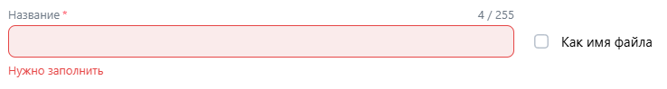
* Аудитории. Загрузить новый список пользователей. Включить чекбокс `Как имя файла`, выбрать файл `users_valid.txt`. Проверить, что `Название` автозаполнилось «users» и стало недоступно для редактирования.
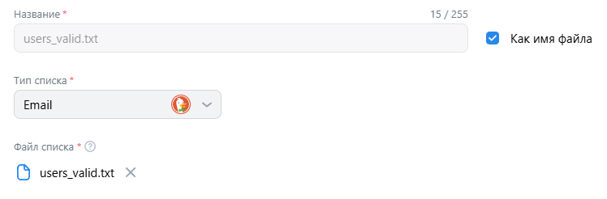
* Аудитории. Загрузить новый список пользователей. Отключить чекбокс `Как имя файла`. Убедиться, что поле `Название` снова редактируемое и значение сохранилось.
* Аудитории. Загрузить новый список пользователей. Изменить `Название` вручную, затем снова включить `Как имя файла`. Проверить, что имя перезаписалось именем файла.
* Аудитории. Загрузить новый список пользователей. Последовательно выбрать каждое доступное значение `Тип списка` и убедиться, что оно корректно применяется без ошибок.
* Аудитории. Загрузить новый список пользователей. Оставить `Тип списка` пустым. Проверить, что появляется обязательная ошибка.
* Аудитории. Загрузить новый список пользователей. Попробовать загрузить файл неподдерживаемого типа (например, `.png`). Проверить, что появляется ошибка о формате.
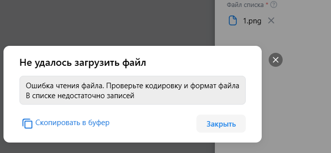
* Аудитории. Загрузить новый список пользователей. Загрузить файл размером > 128 МБ. Проверить, что выводится ошибка о превышении лимита.
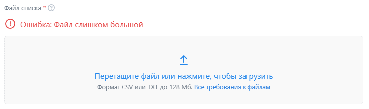
* Аудитории. Загрузить новый список пользователей. Загрузить файл [users_wrong.txt](./files/users_wrong.txt), содержащий некорректные данные. Проверить, что появилась ошибка с указанеим строк неверного формата.
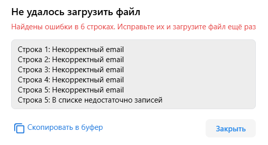
* Аудитории. Загрузить новый список пользователей. Загрузить валидный файл [users_valid.txt](./files/users_valid.txt). Проверить, что файл принят и верно отображается во вкладке `Создание аудитории`.
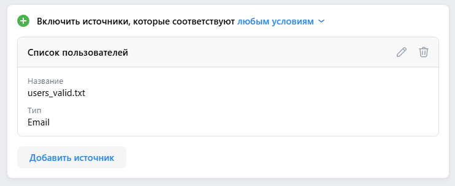
* Аудитории. Удаление списка пользователей. Нажать на иконку корзины в блоке списка пользователей. Подтвердить удаление нажатием кнопки `Удалить` в появившемся модальном окне. Проверить, что список удалился.
* Аудитории. Исключить источник. Загрузить файл [users_exclude.txt](./files/users_exclude.txt). Проверить, что файл принят и верно отображается во вкладке `Создание аудитории`.
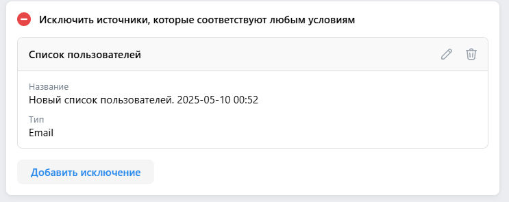
* Аудитории. Создание аудитории. Нажать на кнопку `Сохранить`. Проверить, что аудитория отображается в блоке аудиторий.
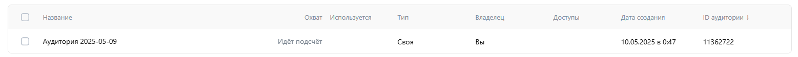
* Аудитории. Создание аудитории. Добавить источник. Нажать на кнопку `Уже созданная аудитория`. Проверить, что созданная аудитория отобразилась в списке.
* Аудитории. Создание аудитории. Добавить источник. Нажать на кнопку `Категории мобильного приложения`. В поле `Мобильная платформа` выбрать `Android`, в поле `Категория` выбрать `Бизнес`, в поле `Кого добавить в аудиторию` выбрать `Установили приложение`. Нажать на кнопку `Сохранить`. Проверить, что источник корректно отображается.
* Аудитории. Создание аудитории. Добавить источник. Нажать на кнопку `Вводили ключевые фразы`. В поле `Ключевые фразы` ввести `технопарк`, нажать на кнопку `Сохранить`. Проверить, что источник корректно отображается.
* Аудитории. Создание аудитории. Добавить источник. Нажать на кнопку `Подписчики сообществ`. В поле `Название сообщества` ввести `VK Education`, в списке нажать на `Сообщетсва ВКонтакте` и выбрать `VK Education`. Нажать на кнопку `Сохранить`. Проверить, что источник корректно отображается. 
* Аудитории. Создание аудитории. Добавить источник. Нажать на кнопку `Слушатели музыкантов`. В поле `Введите название музыканта` ввести `TOKYOPILL`, в списке выбрать `TOKYOPILL` и нажать на кнопку `Готово`. Нажать на кнопку `Сохранить`. Проверить, что источник корректно отображается. 
* Аудитории. Создание аудитории. Добавить источник. Нажать на кнопку `Пользуются VK Mini Apps или играют ВКонтакте`. В поле `Введите название мини-приложения или игры` ввести `хомяк`, в списке выбрать `хомяк` и нажать на кнопку `Готово`. Нажать на кнопку `Сохранить`. Проверить, что источник корректно отображается. 
* Аудитории. Удаление аудитории. В строке аудитории выбрать чек-бокс и нажать на иконку корзины. Подтвердить удаление нажатием на кнопку `Удалить`. Проверить, что аудитория удалилась.
*  Аудитории. Создать офлайн конверсии. Загрузить список. Создать новый. В поле `Тип списка` выбрать `Email`, загрузить файл [users_emails.csv](./files/users_emails.csv). Нажать на кнопку `Сохранить`. Проверить, что список корректно отображается.
*  Аудитории. Создать офлайн конверсии. Загрузить список. Добавить в существующий. В поле `Название списка` выбрать существующий список, загрузить файл [users_emails_addition.csv](./files/users_emails_addition.csv). Нажать на кнопку `Сохранить`. Проверить, что поле `Всего пользователей` изменило значение.
  

# Создание каталога

* Каталог. Форма создания каталога. Поле `Название каталога`. Оставить поле пустым. Проверить, что появилась ошибка.
* Каталог. Форма создания каталога. Поле `Название каталога`. Ввести в названии один пробелы. Проверить, что появилась ошибка.
* Каталог. Форма создания каталога. Блок `Добавление позиций`. Нажать на кнопку `Вручную`. Проверить, что появляется окно загрузки файла фида.
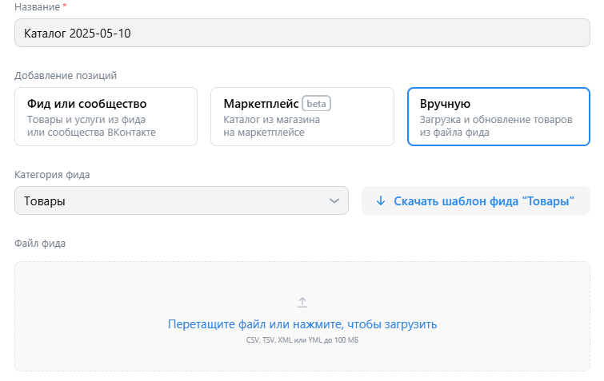
* Каталог. Форма создания каталога. Поле `Файл фида`. Доавить файл [catalog_products.csv](./files/catalog_products.csv). Проверить, что файл корректно загружен.
* Каталог. Форма создания каталога. При загруженном файле [catalog_products.csv](./files/catalog_products.csv) нажать на кнопку `Создать каталог`. Проверить, что каталог отображается в блоке каталогов.
* Каталог. Форма создания каталога. Кнопка `Создать каталог`. Если поле `Файл фида` не заполнено, то при нажатии на кнопку появится надпись `Нужно заполнить`.
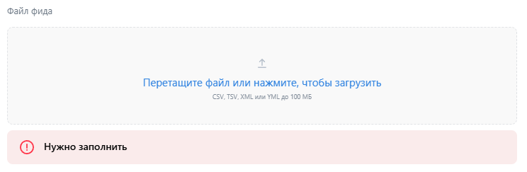
* Каталог. Форма создания каталога. Нажать на кнопку `Отмена`. Проверить, что форма закроется.
* Каталог. Товары. Поле `Поиск каталогов`. Ввести в поле `Худи`. Проверить, что в выпадающем списке отображается товар `Худи VK`.
* Каталог. Товары. Нажать на кнопку `Добавить товары`. Проверить, что открывается модальное окно добавления товаров.
* Каталог. Товары. Модальное окно добавления товаров. Загрузить файл [catalog_products_new.csv](./files/catalog_products_new.csv) Нажать на кнопку `Продолжить`. Проверить, что товары добавились в каталог и в разделе `История загрузок` появилась новая запись.
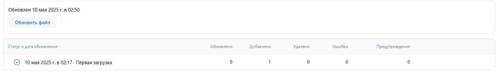
* Каталог. Товары. Модальное окно добавления товаров. Нажать на кнопку `Отмена`. Проверить, что модальное окно закрылось.
* Каталог. Товары. Хедер. Выпадающий список `Каталоги`. Выбрать созданный каталог. Проверить, что открылась страница выбранного каталога.
* Каталог. Группы. Кнопка `Создать группу`. Нажать на кнопку. Проверить, что появились кнопки `Использовать фильтры` и `Выбрать товары вручную`.
* Каталог. Группы. Нажать на кнопку `Использовать фильтры`. Проверить, что открылось модальное окно фильтров.
* Каталог. Группы. Модальное окно фильтров. Нажать на кнопку `Добавить фильтр`. Проверить, что добавился новый фильтр.
* Каталог. Группы. Модальное окно фильтров. Нажать на кнопку `Сохранить`. Проверить, что группа создалась и отображается в списке групп.

* Каталог. Группы. Модальное окно фильтров. Кнопка `Отмена`. Нажать на кнопку. Проверить, что модальное окно закрылось.
* Каталог. Группы. Нажать на кнопку `Выбрать товары вручную`. Проверить, что открылось модальное окно выбора товаров.
* Каталог. Группы. Модальное окно выбора товаров. Поле `Поиск товаров`. Ввести в поле `Худи`. Проверить, что в списке отображается товар `Худи VK`.
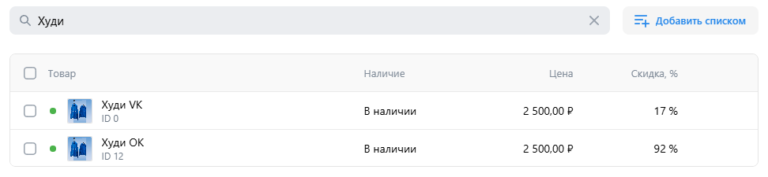
* Каталог. Группы. Модальное окно выбора товаров. Поле `Поиск товаров`. Ввести в поле `QAQAQA`. Проверить, что появилась надпись `Ничего не нашлось`.
* Каталог. Группы. Модальное окно выбора товаров. Выбрать товар `Худи VK`. Проверить, что товар отмечен для добавления в группу.
* Каталог. Группы. Модальное окно выбора товаров. Нажать на кнопку `Сохранить`. Проверить, что товар `Худи VK` добавился в группу и отображается в её списке товаров.
* Каталог. Группы. Модальное окно выбора товаров. Кнопка `Отмена`. Нажать на кнопку. Проверить, что модальное окно закрылось.
* Каталог. Группы. Список групп. Поле `Поиск групп`. Ввести в поле `Все`. Проверить, что отображается группа `Все товары`.
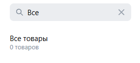
* Каталог. Группы. Список групп. Поле `Поиск групп`. Ввести в поле `QAQAQA`. Проверить, что список пуст.
* Каталог. Группы. Список групп. Выбрать группу `Все товары`. Проверить, что открылась страница группы `Все товары`.
* Каталог. Созданная группа. Нажать на кнопку `Редактировать`. Проверить, что открылось модальное окно редактирования группы.
* Каталог. Созданная группа. Модальное окно редактирования. Изменить название группы на `Тестовая группа`, нажать на кнопку `Сохранить`. Проверить, что в списке групп отображается название `Тестовая группа`.
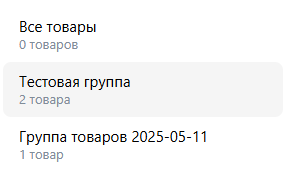
* Каталог. Созданная группа. Нажать на кнопку `...`, затем нажать на кнопку `Удалить группу`. Подтвердить удаление, нажав кнопку `Удалить`. Проверить, что группа удалилась.
* Каталог. История загрузок. Кнопка `Обновить файл`. Нажать на кнопку. Проверить, что открылось модальное окно загрузки файла фида.
* Каталог. Удаление каталога. В списке каталогов навести указатель на кнопку `...` и нажать на кнопку `Удалить каталог`. Подтвердить удаление, нажав кнопку `Удалить`. Проверить, что каталог удалился.
